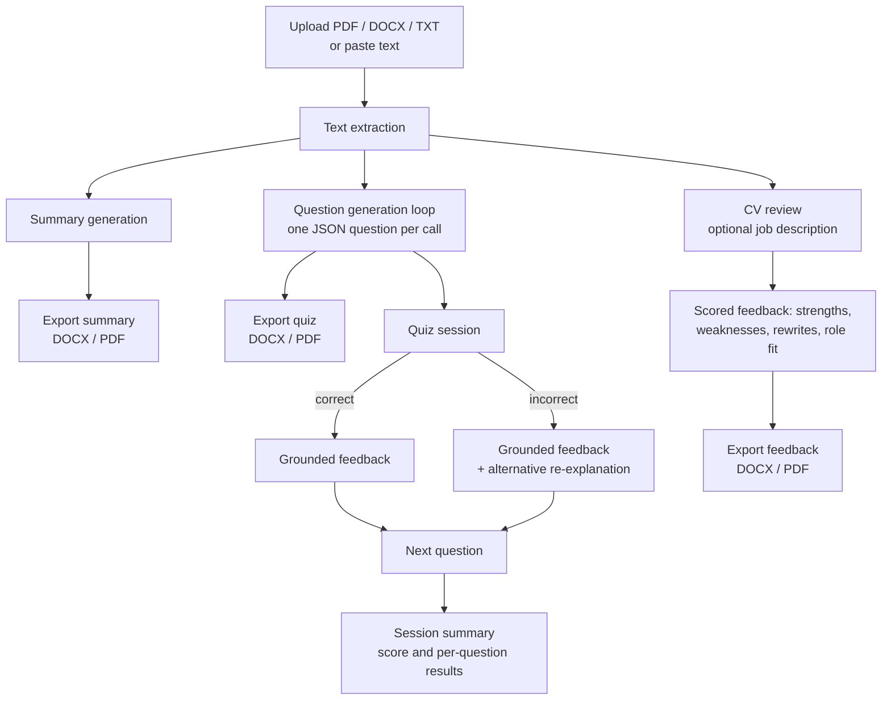

# Study-Buddy

An LLM-powered study tool built with Streamlit and the Claude API. It ingests lecture notes (PDF, DOCX or TXT), produces structured revision summaries, generates topic-tagged multiple-choice quizzes, and re-explains a concept in a different way whenever a question is answered incorrectly. Summaries and quizzes can be exported to Word or PDF. A second tool, **CV review**, reuses the same ingestion and export pipeline to give evidence-based feedback on a CV, optionally against a specific job description. A SQLite persistence layer implementing the **SM-2 spaced-repetition algorithm** is included for scheduling reviews across sessions.


---

## Architecture



The two tools share one app and are selected from the sidebar: **Study** (summaries and quizzes) and **CV review**.

| File | Role |
|---|---|
| `app.py` | Streamlit app: ingestion, LLM calls, quiz state machine, CV review, exports |
| `db.py` | SQLite persistence layer with SM-2 spaced-repetition scheduling |
| `prompts.py` | Refined prompt templates, including topic-label consistency and quality scoring |
| `test_db.py` | End-to-end check of the database layer (create topic → add card → review → mastery report) |
| `01_generate_questions.py`, `02_quiz_with_grading.py` | Early command-line prototypes (see [Prompt design history](#prompt-design-history)) |

---

## Techniques

### 1. Document ingestion

Uploads are routed by file extension to a format-specific extractor, all operating on in-memory bytes:

- **PDF:** `pypdf` extracts text page by page. If no text comes back, the file is treated as a scanned (image-only) PDF and the user gets a clear error rather than an empty quiz.
- **DOCX:** `python-docx` reads paragraphs and drops empty ones.
- **TXT:** decoded as UTF-8, ignoring undecodable bytes.

Users can also paste text directly; an uploaded file takes priority over pasted text.

### 2. Summarisation

The extracted text is sent to Claude (`claude-sonnet-4-6`) with a prompt asking for concise, revision-focused notes organised under short headings and bullet points, prioritising key concepts over minor detail. The Markdown output is rendered in the app and reused directly by the export functions.

### 3. Structured question generation

Each question is generated by a separate API call that must return a strict JSON object:

```json
{
  "topic": "2-4 word sub-topic label",
  "question": "...",
  "options": {"A": "...", "B": "...", "C": "...", "D": "..."},
  "correct_answer": "A"
}
```

Key design choices:

- **Reasoning over recall.** The prompt asks for questions that test understanding rather than "what is X" definitions.
- **Distractor constraints.** Exactly one option must be correct, and the other three must be plausible to a novice but clearly wrong to someone who understands the material.
- **Topic tagging.** Every question carries a short sub-topic label, used in the quiz UI, the exports, and the results breakdown.
- **History-conditioned de-duplication.** Questions are generated sequentially, and the text of every question already asked is injected into the next prompt with an instruction not to repeat it. This trades extra latency (N calls for N questions) for better coverage of the material than a single batch request.
- **Defensive parsing.** Responses are stripped of any Markdown code fences before `json.loads`, and if generation fails partway through, the error reports how many questions were successfully generated.

### 4. Deterministic grading, LLM-generated feedback

Correctness is **decided in code**, by comparing the selected option with `correct_answer`, never by the model. The LLM is used only to explain the result: it receives the study material as ground truth, the question, all options, the correct answer and the student's choice, and writes a 2-3 sentence explanation of why the chosen answer was right or wrong.

Separating scoring from explanation keeps the score reliable and reproducible while still giving natural-language feedback grounded in the source notes.

### 5. Alternative re-explanation on incorrect answers

When an answer is wrong, a second call generates a **re-explanation of the underlying concept using a different framing**, such as an analogy or a simpler model, rather than restating a textbook definition. The prompt restricts the model to the uploaded study material to reduce the risk of introducing facts that aren't in the notes. The learner sees the standard feedback and the alternative explanation side by side.


### 6. Quiz session as a state machine

Streamlit re-runs the whole script on every interaction, so the quiz is modelled as an explicit state machine stored in `st.session_state`:

```
setup → quiz → graded   → quiz → ... → summary
             ↘ reteach ↗
```

The session state also holds the question queue, the current index, per-question results and generated content, so nothing is lost between reruns. Each question's radio button uses an index-specific widget key, so the previous answer never carries over to the next question.

### 7. Document export

All exports are built in memory (`io.BytesIO`) and served through Streamlit download buttons, with no files written to disk.

- **Word:** a lightweight Markdown-to-DOCX converter maps `#`/`##` headings and `-`/`*` bullets onto native Word heading and list styles. Quiz exports include topic tags and the correct answer highlighted in green.
- **PDF:** generated with `fpdf2`. Because its built-in fonts only support Latin-1, text is sanitised before rendering so unsupported characters are dropped instead of crashing the export. Every `multi_cell` call explicitly returns the cursor to the left margin, since recent `fpdf2` versions otherwise leave it at the right edge and the next line has no room to render.

The export builders take a document title as a parameter, so the same Markdown-to-DOCX/PDF code serves study summaries, quizzes and CV feedback.

### 8. Spaced-repetition layer (SM-2)

`db.py` implements a persistence layer for long-term review scheduling, using SQLite with three tables:

| Table | Stores |
|---|---|
| `topics` | Topic name (unique) and source notes |
| `cards` | Question, options (JSON), correct answer, and SM-2 state: repetitions, ease factor, interval, next review date |
| `review_log` | Every review with correctness and a 0-5 quality score |

After each review, `update_card_after_review` applies the SM-2 algorithm:

- **Quality < 3 (incorrect):** repetitions reset to 0 and the card is due again in 1 day.
- **Quality ≥ 3 (correct):** intervals grow from 1 day, to 6 days, then to `previous interval × ease factor`.
- **Ease factor update:** `EF' = EF + (0.1 − (5 − q)(0.08 + (5 − q)·0.02))`, floored at 1.3, so cards that are consistently hard come back more often.

Supporting queries return cards that are due for review (oldest first), a per-topic mastery report (a card counts as mastered after 3 consecutive successful repetitions), and recent review history.

**Status:** the scheduling layer is implemented and exercised by `test_db.py`; connecting it to the Streamlit quiz flow is the next step on the roadmap.

### 9. CV review

A separate page applies the same pipeline to career feedback. The user uploads a CV (PDF, DOCX or TXT, handled by the same extractors as study notes) and can optionally paste a job description.

The model acts as a recruiter and returns **structured JSON**:

| Field | Contents |
|---|---|
| `overall_score` | Integer from 1 to 10 |
| `overall_summary` | 2-3 sentence assessment |
| `strengths` | 3-5 items, each with `evidence` from the CV |
| `weaknesses` | 3-5 items, each with `why_it_matters` and a concrete `how_to_fix` |
| `bullet_rewrites` | 2-4 original bullets with an improved version |
| `role_fit` | `matching` and `gaps` against the job description |

The prompt is designed to keep feedback grounded and honest:

- **Evidence requirement.** Every strength must point to something actually written in the CV, which makes each claim verifiable and discourages generic praise.
- **No fabrication in rewrites.** Improved bullets may not introduce facts or numbers absent from the original. Where a metric would help, the model inserts a placeholder such as `[X%]` for the candidate to fill in, so the tool never invents achievements.
- **Conditional role matching.** The prompt changes depending on whether a job description is supplied: with one, `role_fit` compares the CV against its requirements; without one, the model is told to return empty lists rather than guess at a target role.

Results are rendered as strengths and weaknesses side by side, before/after bullet comparisons and a coverage-vs-gaps view for the role, and can be downloaded as Word or PDF by converting the JSON to Markdown and passing it through the shared export builders. Malformed JSON is caught separately from other errors so the user gets a clear prompt to retry. The CV is processed in memory and not stored by the app.

### 10. API key handling

`get_api_key()` checks Streamlit secrets first (for Streamlit Community Cloud) and falls back to an environment variable loaded from `.env` via `python-dotenv` (for local development), so the same code runs in both environments without credentials in the repository.

---

## Prompt design history

The prototypes show how the interaction design evolved:

1. **`01_generate_questions.py`:** generates three open-ended questions as a numbered list.
2. **`02_quiz_with_grading.py`:** one free-response question, graded by the LLM against the notes using a fixed `VERDICT` / `FEEDBACK` output format that rewards correct reasoning over keyword matching.
3. **`app.py`:** switched to multiple choice with strict JSON output. This made grading deterministic, removed the model from the scoring path, and made questions easy to store, export and schedule.

---

## Running locally

```bash
git clone https://github.com/saratheiranian/study-buddy.git
cd study-buddy
python3 -m venv .venv
source .venv/bin/activate
pip install -r requirements.txt
```

Add your Anthropic API key (from [console.anthropic.com](https://console.anthropic.com)) using **either** option:

```bash
# Option 1: Streamlit secrets
mkdir -p .streamlit
echo 'ANTHROPIC_API_KEY = "your-key-here"' > .streamlit/secrets.toml

# Option 2: .env file
echo 'ANTHROPIC_API_KEY=your-key-here' > .env
```

Both files are git-ignored. Then run:

```bash
python -m streamlit run app.py
```

Use the sidebar to switch between **Study** and **CV review**.

To exercise the spaced-repetition layer on its own:

```bash
python test_db.py
```

---

## Limitations and future work

- **Connect SM-2 to the UI.** Save generated questions as cards, feed each answer's quality score into `update_card_after_review`, and add a "due for review" mode so weak topics resurface in later sessions.
- **Re-test after re-teaching.** Automatically queue a new question on the same topic after an alternative explanation, to check the concept has actually landed.
- **Topic-label drift.** Labels generated independently per question can vary for the same concept (e.g. "Soundness and Completeness" vs "Soundness vs Completeness"). `prompts.py` adds an instruction to reuse existing labels; passing the list of existing topics into the prompt or normalising labels would fix this more robustly.
- **Guaranteed structured output.** Using tool use / structured outputs instead of prompt-only JSON instructions would remove the need for fence-stripping and parsing fallbacks.
- **Cost and latency.** The full notes are sent with every call. Prompt caching would cut repeated input cost, and generating questions in parallel (with de-duplication applied afterwards) would reduce wait time.
- **Long and scanned documents.** Very long notes could exceed context limits and would benefit from chunking by section. Scanned PDFs would need OCR.
- **CV scoring is subjective.** The 1-10 score comes from a single model judgement and can vary between runs. Scoring against an explicit rubric (e.g. impact, clarity, relevance, formatting) and averaging several samples would make it more consistent.
- **CV privacy.** CVs contain personal data and are sent to the Claude API for analysis. The app doesn't store them, but a public deployment should state this clearly (the page does) and avoid logging uploads.
- **PDF export characters.** Latin-1 sanitisation drops non-Latin characters; embedding a Unicode TTF font would preserve them.
